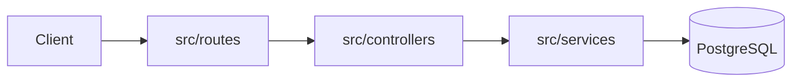

# Architecture doc template

Applies to `docs/ARCHITECTURE.md` in the single-file case, and to the top-level `docs/ARCHITECTURE.md` (system view) plus each `docs/modules/<name>.md` (module detail) in the split case.

## docs/ARCHITECTURE.md structure

```markdown
# Architecture

## Overview

<2-4 sentences: what the system is made of at the highest level, and the overall design pattern if one genuinely applies (layered, MVC, microservices, event-driven, monorepo with shared packages, plugin architecture, etc.). Don't force a pattern name onto a project that doesn't clearly follow one — "a single Express app organized by feature folder" is a fine description on its own.>

## How it fits together

<A short diagram-in-prose or an actual diagram (ASCII, or a mermaid block — Markdown renderers on GitHub/GitLab support mermaid) showing the major components and how they talk to each other. Follow one concrete request or task through the system end to end, naming real files/modules at each step, so a reader could trace it in the code.>

Example mermaid form:


## Directories

<One entry per top-level (or otherwise significant) directory: its purpose and how it relates to the others. This is the map; the file-by-file table below is the detail.>

| Path | Purpose |
|---|---|
| `src/routes/` | HTTP route definitions, one file per resource |
| `src/services/` | Business logic, called by routes and by background jobs |
| `src/models/` | Database schema/ORM models |

## File reference

<The file-by-file table. One row per significant file/module — see SKILL.md for what counts as significant. Group by directory if the table gets long.>

| File | Purpose |
|---|---|
| `src/index.js` | Entry point — loads config, connects to the DB, starts the HTTP server |
| `src/routes/users.js` | User CRUD routes, delegates to `services/userService.js` |
| `src/services/userService.js` | User business logic: validation, password hashing, calls `models/User.js` |

## Key design decisions / gotchas

<Optional but valuable: anything a newcomer would otherwise have to discover by trial and error — why a directory that looks unused actually isn't, a non-obvious dependency between two modules, a deliberate deviation from the framework's default pattern. Only include things you actually found evidence for; don't speculate.>
```

## When to split into docs/modules/

Split when a single file would stop being a readable map — multiple independently-deployable services, a monorepo with several real packages, or a codebase large enough that one file-reference table would run to hundreds of rows.

In the split case:
- `docs/ARCHITECTURE.md` keeps the Overview, the system-level "how it fits together" diagram/flow (showing how modules/services relate to each other, not their internals), and a directories table one level deep — then links to each module doc instead of embedding its file table.
- `docs/modules/<name>.md` follows the same template scoped to just that module: its own overview, internal flow, and file reference table.
- Name module docs after the module/service/package name, not generic labels (`docs/modules/auth-service.md`, not `docs/modules/module1.md`).

## Judgment calls

- A table is the default for the file reference because it's scannable; prose is fine for the Overview and flow sections.
- Keep purpose descriptions to one or two sentences — this is a map, not a tutorial. If a file needs a paragraph to explain, that's a sign it might deserve its own short section instead of a table row.
- If the project already has architecture notes somewhere (a wiki link, comments in a root file, an ADR folder), read them first — reconcile with what the code shows rather than contradicting them silently.
